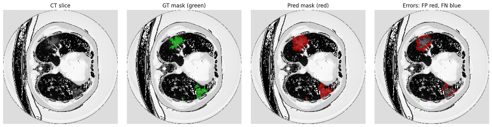

# U-Net COVID-19 CT Segmentation  

*A representative error map produced by our pipeline.* 

  
 

---

## 🚀 Features

- **Data cleaning & split**  
  - `check_dataset_consistency.py` – remove any mismatched or missing `.npy` files  
  - `generate_kfold.py` – create 5-fold train/val splits  
    - **Note:** `generate_kfold.py` reads all image IDs from `data/all_list.txt`.  

- **Model training**  
  - `train.py` – 5-fold cross-validation of a U-Net  
    - preprocessing: lung-window clipping (−1000…400 HU) → [0,1], global mean/std normalization  
    - loss: 0.4 × BCE + 0.6 × Dice  
    - optimizer: Adam (lr = 1e-4), batch size = 16, epochs = 20  
    - checkpoints every _K_ epochs + final per-fold model  
    - optional mixed-precision (`--amp`)

- **Quantitative evaluation**  
  - `evaluate_test.py` – compute Dice, IoU, sensitivity, specificity, Hausdorff on a held-out test set  

- **Qualitative visualization**  
  - `visualize_errors.py` – generate side-by-side CT, GT mask, prediction, and error map  

---

## 📁 Repository Structure

```
Pytorch-UNet/
├─ data/
│   ├─ all_list.txt       # list of all <ID>.npy in imgs/
│   ├─ imgs/              # raw CT slices (.npy)
│   ├─ masks/             # binary masks (.npy)
│   ├─ train_new0.txt …   # fold splits
│   └─ valid_new4.txt
├─ unet/                  # U-Net implementation
├─ utils/                 # Dice score & helper functions
├─ check_dataset_consistency.py
├─ generate_kfold.py
├─ train.py
├─ evaluate_test.py
├─ visualize_errors.py
├─ requirements.txt
└─ README.md
```

---

## ⚙️ Installation

```bash
git clone https://github.com/dmasamba/Pytorch-UNet.git
cd Pytorch-UNet
python3 -m venv venv
source venv/bin/activate
pip install --upgrade pip
pip install -r requirements.txt
```

---

## 🗂️ Data Preparation

1. **Clean dataset**  
   ```bash
   python check_dataset_consistency.py \
     --imgs-dir data/imgs \
     --masks-dir data/masks
   ```
   This removes any entries in `imgs/` or `masks/` without a matching counterpart.

2. **List your data**  
   ```bash
   ls data/imgs/*.npy | xargs -n1 basename -s .npy > data/all_list.txt
   ```
   This generates `data/all_list.txt`, which `generate_kfold.py` uses to partition your data.

3. **Generate 5-fold splits**  
   ```bash
   python generate_kfold.py \
     --imgs-dir   data/imgs \
     --all-list   data/all_list.txt \
     --n-folds    5
   ```
   Creates `data/train_new0.txt`…`data/train_new4.txt` and corresponding `valid_new*.txt`.

---

## 🏋️ Training

```bash
python train.py \
  --epochs 20 \
  --batch-size 16 \
  --learning-rate 1e-4 \
  --scale 0.5 \
  --num-folds 5 \
  --augment \
  --amp \
  --save-ckpt \
  --checkpoint-interval 5 \
  --vis-batches 3 \
  --save-interval 1 \
  --output-dir outputs/
```

- `--augment` enables on-the-fly rotations & horizontal flips  
- `--amp` uses mixed-precision during evaluation  

**Outputs**  
```
checkpoints/
├─ fold0.pth
└─ fold4.pth

outputs/
├─ fold0/
│   ├─ inputs/
│   ├─ ground_truths/
│   └─ predictions/
└─ fold4/…
```

---

## 📈 Test-Set Evaluation

Prepare `data/test.txt` with one test ID per line. Then:

```bash
python evaluate_test.py \
  --imgs-dir   data/imgs \
  --masks-dir  data/masks \
  --test-list  data/test.txt \
  --ckpt-dir   checkpoints \
  --plot-dir   plots \
  --device     cuda \
  --scale      0.5 \
  --bilinear
```

Generates:
- `plots/dice_boxplot.png`  
- `plots/iou_boxplot.png`  
- `plots/sensitivity_boxplot.png`  
- `plots/specificity_boxplot.png`  
- `plots/hausdorff_boxplot.png`  

**Sample results (Table I):**

| Metric      | Mean ± Std      |
|-------------|-----------------|
| Dice        | 0.5341 ± 0.1974 |
| IoU         | 0.3884 ± 0.1804 |
| Sensitivity | 0.9179 ± 0.1460 |
| Specificity | 0.9944 ± 0.0057 |
| Hausdorff   | 61.57 ± 51.01   |

---

## 👁️ Error-Map Visualization

```bash
python visualize_errors.py \
  --imgs-dir    data/imgs \
  --masks-dir   data/masks \
  --test-list   data/test.txt \
  --ckpt-dir    checkpoints \
  --output-dir  error_vis \
  --threshold   0.5 \
  --scale       0.5 \
  --device      cuda \
  --max-samples 20
```

Produces PNGs in `error_vis/` showing:
1. CT slice  
2. GT mask (green)  
3. Predicted mask (red)  
4. Error map (FP = red, FN = blue)  

---

## 📚 References

1. O. Ronneberger, P. Fischer, T. Brox, “U-Net: Convolutional Networks for Biomedical Image Segmentation,” *arXiv:1505.04597*, 2015.  
2. M. Faure, “U-Net: Semantic segmentation with PyTorch,” GitHub, https://github.com/milesial/Pytorch-UNet.   
3. OpenAI ChatGPT, technical assistance & documentation support, 2024.    
